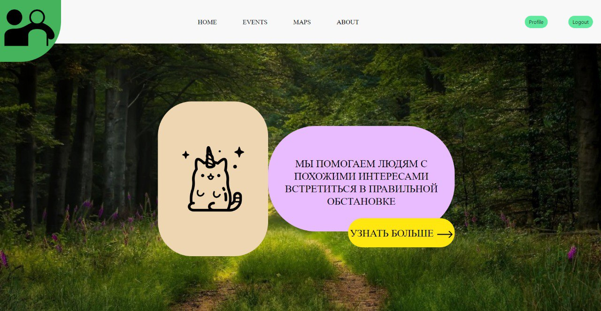
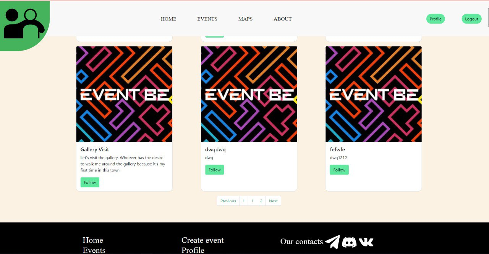
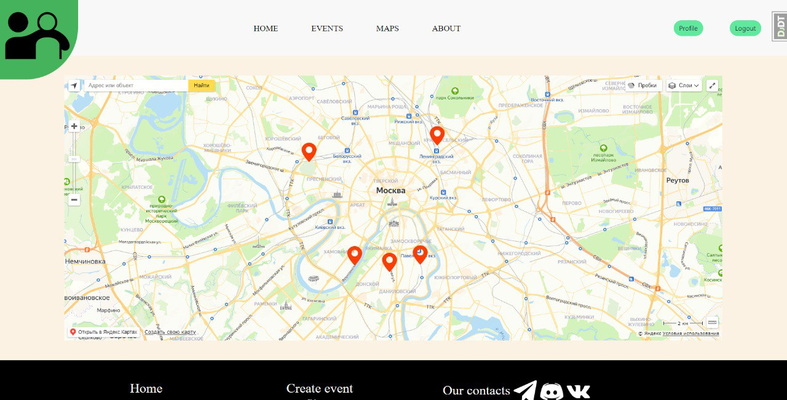

# eventbe

[](https://github.com/mge410/eventbe/actions/workflows/django.yml)
[](https://github.com/psf/black)

**Используемые технологии**

* API Яндекс Карт <br> https://yandex.ru/dev/maps/
* Django 3.2.17 <br> https://www.djangoproject.com/download/
* Python 3.10, 3.11 <br> https://www.python.org/downloads/


**Запуск проекта**

Первый шаг одинаковый, дальше разные для OC Windows/Linux  
**1** Клонируем себе репозиторий:  
```git clone https://github.com/mge410/eventbe.git ```  
и переходим в папку с проектом   
```cd eventbe ```

| Windows:                                                                                                                                                            | Linux:                                                                                                                                                                                             |
|---------------------------------------------------------------------------------------------------------------------------------------------------------------------|----------------------------------------------------------------------------------------------------------------------------------------------------------------------------------------------------|
| **2** Заводим виртуальное окружение и активируем его: <br> ```python -m venv venv ``` <br> ```.\venv\Scripts\activate ```                                           | **2** Заводим виртуальное окружение и активируем его: <br> ```python3 -m venv venv ``` <br> ```source venv/bin/activate ```                                                                        |
| **3** Обновляем pip и качаем туда все что есть в requirements.txt: <br>```python -m pip install --upgrade pip``` <br> ```pip install -r .\requirements\prod.txt ``` | **3** Обновляем pip и качаем туда все что есть в requirements.txt: <br> ```pip install -U pip``` или    ```python3 -m pip install --upgrade pip``` <br> ```pip install -r requirements/prod.txt``` |
| **4** Загружаем миграции для базы данных <br>```python .\eventbe\manage.py migrate``` <br>                                                                          | **4** Загружаем миграции для базы данных <br>```python eventbe/manage.py migrate``` <br>                                                                                                           |
| **5** Cоздаём пользователя администратора для доступа в админку  <br>```python .\eventbe\manage.py createsuperuser```                                               | **5** Cоздаём пользователя администратора для доступа в админку <br>```python eventbe/manage.py createsuperuser``` <br>                                                                            |
| **6** Запускаем проект: <br> ``` python .\eventbe\manage.py runserver ```                                                                                           | **6** Запускаем проект: <br> ```python3 eventbe/manage.py runserver```                                                                                                                             |

---

**Настройка проекта**  
В репозитории есть пример файла с настройками проекта __example_config.env__
копируем его файл с названием .env внутри проекта в папку eventbe   
__Для Windows__   
```cp example_config.env .\eventbe\.env```   
__Для linux__   
```cp -r example_config.env /eventbe/.env```   
После чего его можно настроить под себя


***Установка зависимостей***  
```cd requirements```  

Основные зависимости:  
```python -m pip install --upgrade pip```   
```pip install -r prod.txt ```  

Зависимости для разработки  
``` pip install -r dev.txt```  

Зависимости для тестирования   
``` pip install -r test.txt```

Схема Базы Данных в проекте  


**ScreenShots**


